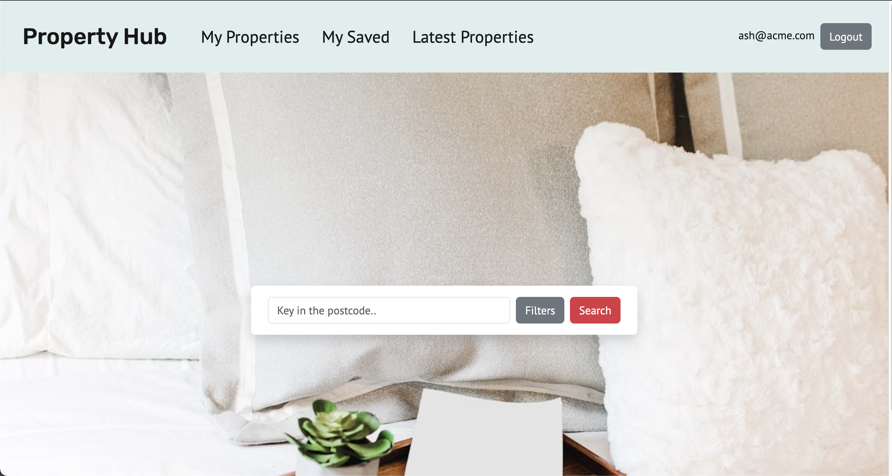
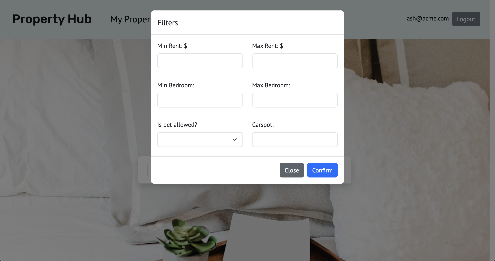
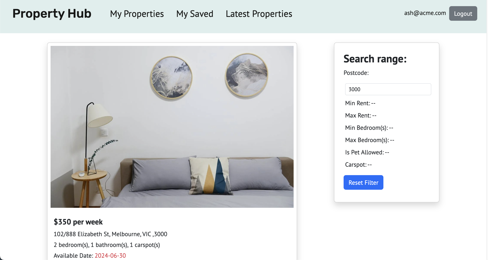
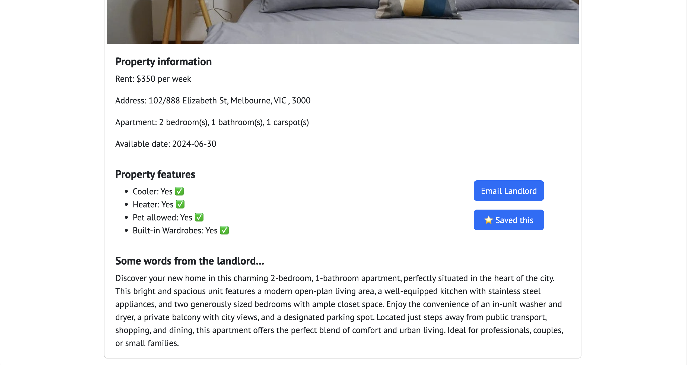
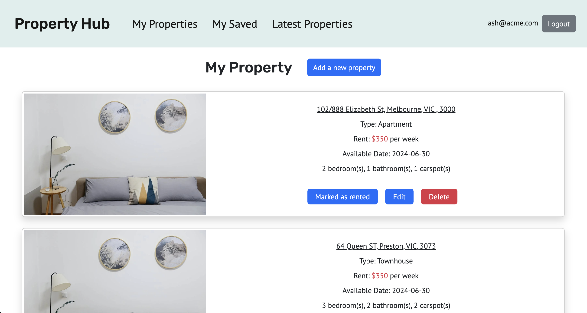
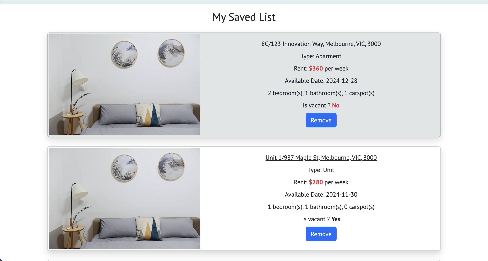

# PropertyHub (rental platform)

### **Technologies used**

---

- Responsive Web Design
- Test: xUnit
- Back End: C#, ASP .net core, Entityframework core, Sql server, OData, OpenAPI
- Front End: Typescript, React vite framework, HTML5, SCSS/CSS5, Bootstrap,react-paginate, react router

### **Description**

---

- Developed Restful API application using C#, ASP .NET Core, EntityFrameworkCore, SQL Server, OpenAPI and Odata
- Designed and Developed the SPA application using Figma, Typescript, React.js(Vite) and React router
- Employed xUnit for conducting integration tests between the database instance and service
- Created responsive websites and visually UI using Bootstrap, HTML5 and CSS3

### **App screenshot**

---

